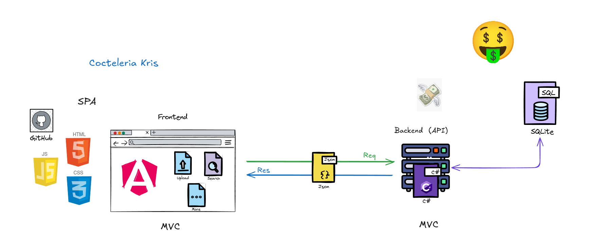

# Cocteleria-Krisfuksito
Este es el proyecto final de M12 hecho por Nil Pernil y Alex el Palomero.

El proyecto es una API interactiva sobre Va-11 Hall-a,
un juego de servir cocteles i emborrachar a los clientes.

Tanto los datos de la API como la tematica
estan basadas en el juego original,
con los cocteles del juego y un ambiente visual de estilo cyberpunk.

## Arquitectura

